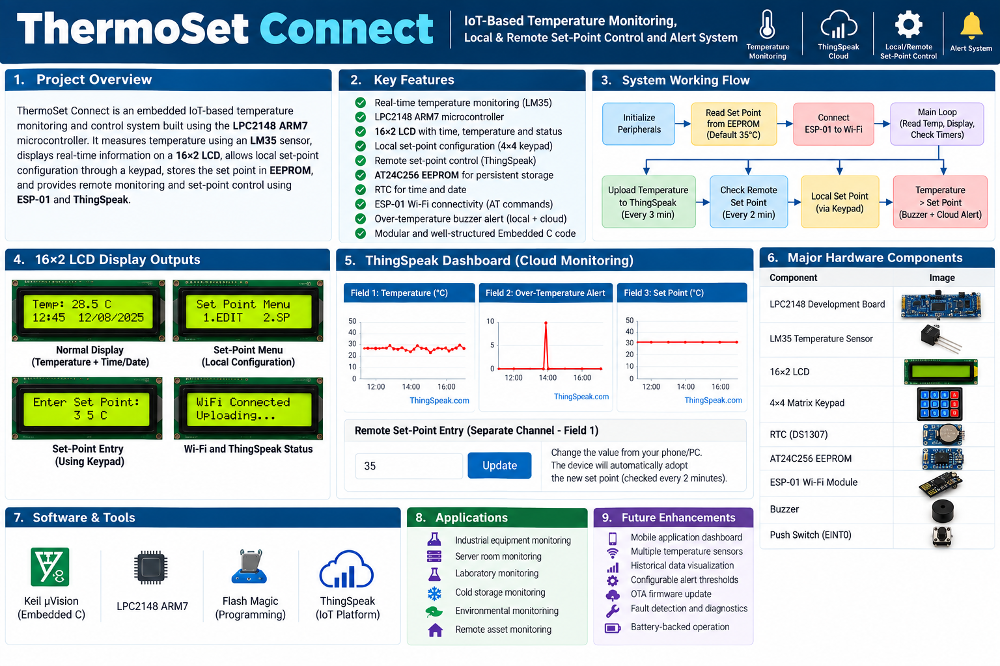
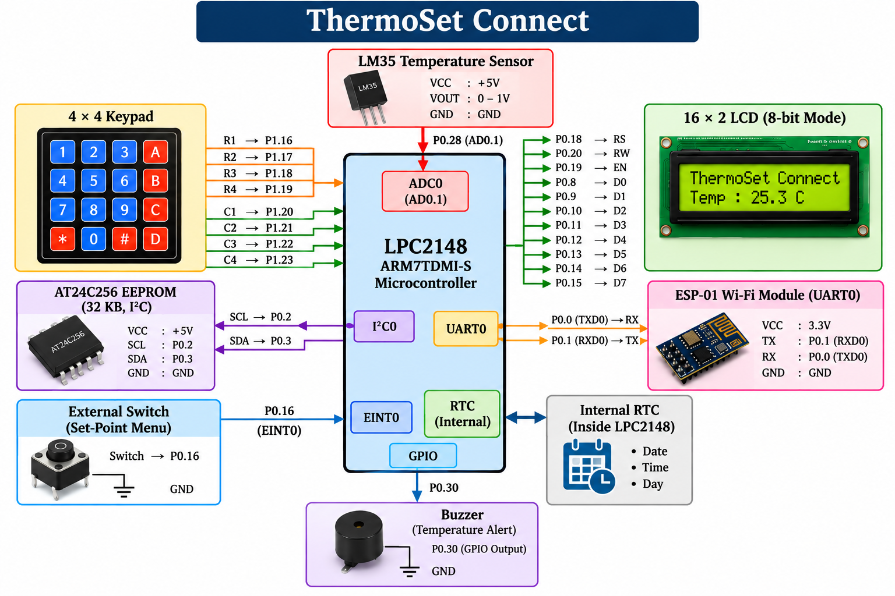

# ThermoSet Connect

### IoT-Based Temperature Monitoring, Local & Remote Set-Point Control System

ThermoSet Connect is an embedded IoT project based on the LPC2148 ARM7 microcontroller. The system monitors temperature using an LM35 sensor, displays temperature and RTC information on a 16×2 LCD, allows local set-point configuration through a 4×4 keypad, stores the set point in EEPROM, and provides remote monitoring and set-point control through an ESP-01 Wi-Fi module and ThingSpeak.





## Features

- LPC2148 ARM7-based embedded system
- LM35 temperature sensing
- ADC-based temperature measurement
- 16×2 LCD display
- RTC time and date display
- 4×4 matrix keypad
- External interrupt for local configuration
- Local temperature set-point configuration
- Remote set-point configuration through ThingSpeak
- AT24C256 EEPROM for persistent set-point storage
- Set-point retained after power OFF/ON
- ESP-01 Wi-Fi connectivity
- ThingSpeak temperature monitoring
- Over-temperature detection
- Local buzzer alert
- Cloud alert upload
- Modular Embedded C firmware

## System Architecture





```text
```

## Hardware Components

| Component | Purpose |
|---|---|
| LPC2148 | Main ARM7 microcontroller |
| LM35 | Temperature sensor |
| AT24C256 | EEPROM for set-point storage |
| 16×2 LCD | Display |
| 4×4 Keypad | Local configuration |
| RTC | Time and date |
| ESP-01 | Wi-Fi communication |
| Buzzer | Over-temperature alert |
| External Switch | EINT0 configuration trigger |

## Software / Tools

- Embedded C
- Keil µVision
- LPC2148 ARM7
- Flash Magic
- UART
- ADC
- I2C
- RTC
- ESP-01 AT Commands
- ThingSpeak

## Working Principle

The LPC2148 reads the temperature from the LM35 through its ADC. The measured temperature is displayed on the LCD and compared with the configured set point.

```text
Temperature > Set Point
        │
        ├── Buzzer Alert
        │
        └── ThingSpeak Alert
```

## Local Set-Point Control

A switch connected to the LPC2148 external interrupt enters the configuration menu.

```text
Switch Press
     ↓
   EINT0
     ↓
Configuration Menu
     ↓
4×4 Keypad
     ↓
New Set Point
     ↓
EEPROM
```

## Remote Set-Point Control

The ESP-01 provides Wi-Fi connectivity between the LPC2148 and ThingSpeak.

```text
Phone / PC
    ↓
ThingSpeak
    ↓
ESP-01
    ↓ UART
LPC2148
    ↓
New Set Point
    ↓
EEPROM
```

The remote set point is checked periodically using:

```c
#define SP_POLL_INTERVAL 2
```

## EEPROM Storage

The configured set point is stored in AT24C256 EEPROM so it is retained after a power cycle.

```c
#define SETPOINT_ADDR 0x77
#define DEFAULT_SETPOINT 35
```

At startup, the LPC2148 reads the stored value. If the value is invalid, the default set point is used and stored.

## ThingSpeak Communication

The ESP-01 communicates with the LPC2148 through UART and uses AT commands for Wi-Fi/network communication.

ThingSpeak is used for:

- Temperature monitoring
- Over-temperature alert reporting
- Set-point information
- Remote set-point entry

### Main ThingSpeak Channel

| Field | Purpose |
|---|---|
| Field 1 | Temperature |
| Field 2 | Over-temperature alert |
| Field 3 | Set-point information |

### Remote Set-Point Channel

| Field | Purpose |
|---|---|
| Field 1 | Remote set-point value |

## Upload Intervals

```c
#define TEMP_UPLOAD_INTERVAL 3
#define SP_POLL_INTERVAL     2
```

| Operation | Interval |
|---|---:|
| Temperature upload | 3 minutes |
| Remote set-point polling | 2 minutes |

## Over-Temperature Detection

The system compares the measured temperature with the configured set point.

When the temperature exceeds the set point:

1. The buzzer generates the local alert pattern.
2. The over-temperature condition is uploaded to ThingSpeak.
3. The cloud alert is edge-triggered so it is not repeatedly uploaded while the same condition remains active.

## Firmware Structure

```text
ThermoSet_Connect/
│
├── src/
│   ├── main.c
│   ├── adc.c
│   ├── cust_lcd.c
│   ├── delay.c
│   ├── eeprom.c
│   ├── esp01.c
│   ├── esp01_call.c
│   ├── i2c.c
│   ├── interrupt.c
│   ├── keypad.c
│   ├── lcd.c
│   ├── lcd_display.c
│   ├── rtc.c
│   └── uart.c
│
├── include/
│   ├── adc.h
│   ├── clock.h
│   ├── cust_lcd.h
│   ├── delay.h
│   ├── eeprom.h
│   ├── esp01.h
│   ├── i2c.h
│   ├── interrupt.h
│   ├── keypad_defines.h
│   ├── lcd_defines.h
│   ├── menu.h
│   ├── rtc.h
│   └── uart.h
│
├── Keil/
│   ├── ThermoSet_Connect.uvproj
│   ├── ThermoSet_Connect.uvopt
│   ├── ThermoSet_Connect.sct
│   ├── Startup.s
│   └── ThermoSet_Connect.hex
│
├── Documentation/
│   └── CHANGES_demo3.txt
│
├── README.md
└── .gitignore
```

## Source File Description

| File | Function |
|---|---|
| `main.c` | Main application logic |
| `adc.c` | ADC and temperature measurement |
| `lcd.c` | LCD driver |
| `lcd_display.c` | LCD display/menu functions |
| `keypad.c` | 4×4 keypad driver |
| `rtc.c` | RTC functions |
| `i2c.c` | I2C communication |
| `eeprom.c` | EEPROM read/write |
| `uart.c` | UART communication |
| `esp01.c` | ESP-01 communication |
| `esp01_call.c` | ESP-01 initialization and ThingSpeak operations |
| `interrupt.c` | External interrupt handling |
| `delay.c` | Delay functions |
| `cust_lcd.c` | Custom LCD functions |

## Communication Interfaces

### ADC

```text
LM35 → LPC2148 ADC
```

### I2C

```text
LPC2148 ↔ AT24C256 EEPROM
```

### UART

```text
LPC2148 ↔ ESP-01
```

### GPIO

Used for LCD, keypad and buzzer control.

### External Interrupt

Used to trigger the local configuration menu.

## Main Program Flow

```text
START
  ↓
Initialize Peripherals
  ↓
Read Set Point from EEPROM
  ↓
Initialize ESP-01
  ↓
Connect to Wi-Fi
  ↓
MAIN LOOP
  ↓
Read RTC
  ↓
Read Temperature
  ↓
Display Temperature / RTC
  ↓
Upload Temperature Periodically
  ↓
Poll Remote Set Point Periodically
  ↓
Check Local Interrupt
  ↓
Check Temperature > Set Point
  ↓
Buzzer / Cloud Alert
  ↓
Repeat
```

## Project Applications

- Industrial temperature monitoring
- Laboratory equipment monitoring
- Server room monitoring
- Storage temperature monitoring
- Remote equipment monitoring
- IoT-based embedded monitoring systems

## Future Enhancements

- Mobile application interface
- Multiple temperature sensors
- Historical temperature graphs
- Configurable alert thresholds
- OTA firmware update
- Additional environmental sensors
- Fault detection and diagnostics

## Project Status

**Completed and demonstrated.**

The project integrates LPC2148 ARM7 firmware, LM35 temperature sensing, RTC, ADC, I2C EEPROM, keypad-based local configuration, ESP-01 Wi-Fi communication and ThingSpeak cloud monitoring.

## Author

**Yeshwanth Botsa**

Embedded Systems | ARM7 | Embedded C | IoT
